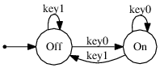
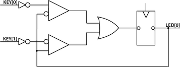

# Getting started with HardCaml on an Altera SoCkit board

The [Altera Cyclone V SoC Development
Kit](https://www.altera.com/products/boards_and_kits/dev-kits/altera/kit-cyclone-v-soc.highResolutionDisplay.html),
referred to from here on as _SoCkit_, is what we'll use in this tutorial. This
is a prototyping board, with an ARM processor, memory, an FPGA, peripherals,
and comes with development tools and examples.

[HardCaml](https://github.com/ujamjar/hardcaml) is an OCaml library for writing
RTL hardware descriptions. In a sense, HardCaml serves the same purpose as VHDL
and Verilog, but brings some of the advantages of OCaml with it, along with
some unique features.

This tutorial pieces together the details required to get started
with programming the FPGA on this specific SoCkit board using HardCaml. By the
end of the tutorial, we will have programmed the FPGA to use keys on the board
as a switch for the LEDs.

## HardCaml

HardCaml will allow us to describe hardware in OCaml. We will generate Verilog
from this description, which will be passed-on to Altera's tools for synthesis.

At this point, I must emphasise that one needs to understand hardware design in
order to use HardCaml. Do not expect HardCaml to translate arbitrary OCaml code
into hardware designs. To understand the example in this tutorial, one needs
only the most basic understanding of register transfer level (RTL) hardware
design. This background is covered in the first four chapters of an excellent
book by _Harris and Harris_, titled _Digital Design and Computer Architecture
(2nd ed.)_.


The HardCaml [tutorial](http://www.ujamjar.com/hardcaml/) is an excellent
resource. The [introduction](http://www.ujamjar.com/hardcaml/introduction.html)
explains how to get set-up and started. For this tutorial, if you wish to skip
reading that documentation, then installing HardCaml through opam will suffice:

    opam install hardcaml

[Combinatorial](http://www.ujamjar.com/hardcaml/combinatorial.html) and
[sequential](http://www.ujamjar.com/hardcaml/sequential.html) logic are
explained subsequently in the HardCaml tutorial. Once again, these are easy to
understand if you already know combinatorial and sequential logic from RTL
design.

## The Example

There are four keys (referred to as `key0`, `key1`, `key2` and `key3` from here
on) and four LEDs accessible by the FPGA on the SoCkit board. The keys would
normally need de-bouncing; however, our design will side-step this to keep
things as simple as possible.

We will make `key0` the 'on' switch, and `key1` the 'off' switch. Pressing
`key0` when the light is on, or pressing `key1` when the light is off will have
no effect. Thus, if `key0` is pressed when the light is off, the signal from it
will bounce, but that does not matter, because we only need to register one of
the bounces. The situation is similar when `key1` is pressed (albeit starting
with the 'on' state).

Our state machine for this design is as follows:



With only two states, all we need is a 1-bit wide register (for the sequential
logic). The next-state logic (i.e. the combinatorial logic) for this design is
simply


where `S` is the current state, `S'` is the next state, and `k..` are the keys.

Note that the signal for the keys from the board is high (or 1) when they are
up, and low (or 0) when they are pressed. The logic above assumes the contrary.
Therefore, we will invert the signal from the keys in our HardCaml design. The
circuit diagram below shows the design we wish to achieve:



We can now start writing up our design in HardCaml. First, the boiler-plate:

~~~ {.ocaml .numberLines}
open Core.Std

open HardCaml.Signal.Comb
open HardCaml.Signal.Seq
~~~

Next, we make a function called `leds` that encodes the above design. It will
accept the two keys as input signals, and will output the signal that needs to
be wired up to the led. As explained earlier, we need to invert the signal from
the keys, so lets begin with that:

~~~ {.ocaml .numberLines startFrom="5"}
let leds key0 key1 =
  let in0 = ~: key0 in
  let in1 = ~: key1 in
~~~

HardCaml provides the `reg_fb` function: a very convenient means of encoding
feedback logic around a register. Using this, we can encode the bulk of our
design in a single line:

~~~ {.ocaml .numberLines startFrom="8"}
  reg_fb r_none empty 1 (fun d -> (d &: (~: in1)) |: ((~: d) &: in0))
~~~

It is of note that the equation describing our next-state logic (a few
paragraphs earlier) is very similar to the combinatorial logic in the line
above (after '`fun d ->`'). One may also notice the double inversion on one of
the keys. That does not matter, since our design will go through multiple
stages of optimization when it is passed on from one tool to another.

Finally, we need code that asks HardCaml to generate Verilog output:

~~~ {.ocaml .numberLines startFrom="9"}
let () =
  let key0 = input "key0" 1 in
  let key1 = input "key1" 1 in
  let circuit = HardCaml.Circuit.make "leds" 
    [ output "q" (leds key0 key1) ] in
  HardCaml.Rtl.Verilog.write (output_string stdout) circuit
~~~

This example is included in this repository as `src/leds.ml`. Compile and run this,
then save the output to a file called `leds.v`:

```bash
ocamlfind ocamlc -linkpkg -thread -package hardcaml,core leds.ml -o leds.native
./leds.native > leds.v
```

The generated Verilog file will contain a module called `leds`.

## Compiling for the FPGA

Our next step is to use Altera's tool-chain to synthesise our design into
a form that can be used to program the FPGA. The _Quartus_ development tools
and examples are included in the SoCkit development kit. We will setup a new
project using Quartus and import `leds.v` into that project.

To get started, we need three files specific to the exact board we are using:

  - The top-level Verilog file (.v extension), also called the top-level design
  entity.
  - The design constraints file (.sdc extension).
  - The pin assignments file (.qsf extension).

These should be included in the material supplied with the SoCkit board, or can
be extracted from the examples (also included in the materials). Let's name
them:

    sockit.{v,sdc,qsf}

Put these files in a directory called `sockit_leds`. This will be our project
directory.

Now, copy over the `leds.v` file we generated from our HardCaml example earlier
to this project directory. The `sockit.v` file will contain the top-level
module declaration, with lots of inputs and outputs defined, including `KEY`,
`LED` and the clock signal `OSC_50_B5B`. Rename this top-level module to
`sockit`. Inside the module declaration, call our generated `leds` module, like
so:

```verilog
      leds(OSC_50_B5B, KEY[0], KEY[1], LED[0]);
```

Install and launch the Quartus GUI.^[These instructions are based on the lab
exercise instructions of the 2014 "ECAD and Architecture Practical Classes" at
the University of Cambridge, taught by Dr Paul Fox, Dr Theo Markettos and Dr
Simon Moore.] On Linux:

    quartus &

Start a new project (**File > New Project Wizard**). In the wizard, choose the
`sockit_leds` directory created earlier as the working project directory. Name
the project `sockit` (to match the top-level design entity name). Enter
`sockit` as the top-level design entity. Click **Next**, then click **Add All**
on the next page to add `sockit.v`, `leds.v` and `sockit.sdc` files to the
project. Click **Next**. We now have to specify the FPGA used in the project.
It is important to select the correct part number, and various filters are
available to narrow it down. The device family for the board I used was
_Cyclone V_, with part number `5CSXFC6D6F31C8ES`. After this step, press
**Finish** to complete project setup.

Next, we need to import pin assignment from our `sockit.qsf` file. Select
**Assignments > Import Assignments ... **, click on the button labelled **...**
and select the `sockit.qsf` file. Click **Ok** a couple of times to complete
this.

By default, Quartus uses Verilog 2001. You might want to change this to
SystemVerilog, by going to **Assignments > Settings... > Analysis & Synthesis
Settings > Verilog HDL Input**.

Save your changes by selecting **File > Save Project**. Select 
**Processing > Start Compilation** to compile the project.

Once the project has been compiled in this manner, subsequent compiles can be
done using the command line. Change directory to the project working directory,
and run:

```bash
quartus_sh --flow compile sockit
```

The above script seems to make certain assumptions about the name of the
project and the name of the top-level. This is why we've chosen the same names
for all three.

## Programming the FPGA

With the design synthesised, we can now program the FPGA. There are two ways to
do this. We will look at how to do this through the USB-blaster interface. The
other option is to boot Linux using the ARM processor on the board, and use
that to program the FPGA. The first method might be quicker, since it
side-steps the setup required to boot Linux.

Power up the board. Obtain a micro-USB to USB cable, and connect the micro-USB
end to the USB-blaster interface on the board. There are multiple micro-USB
interfaces on the board, and the blaster interface is clearly labeled. Connect
the USB end to your workstation. Select **Tools > Programmer**, and at the top
make sure **USB-Blaster ...** appears next to **Hardware Setup...**. If not,
click on **Hardware Setup...**, double click **USB-Blaster ...** in the list
box and then click **Close**.

In the list box, you should see a `.sof` file. This is the file that was
compiled by Quartus and that we are going to use to program the FPGA. If it is
not there, click **Add File...** and select it from the dialog box that opens.
Click **Start** to program the FPGA. After a few seconds you should see the
LEDs on the board flashing. You can now test our LED light-switch by pressing
the keys.

## Summary

In this tutorial, we

  - Designed a simple LED switch digital circuit,
  - Used HardCaml to express the design,
  - Used Quartus tools to synthesise the design,
  - Programmed it on to the FPGA on the SoCkit board.
